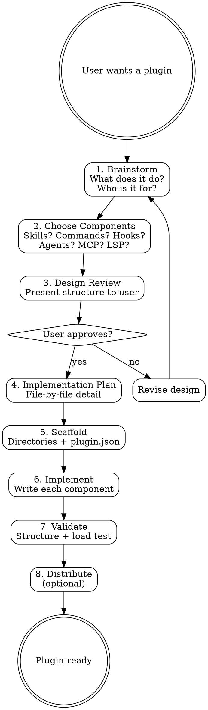

# Building Plugins

A Claude Code plugin is a distributable package of skills, commands, agents, hooks, MCP servers, and LSP servers that extends Claude's capabilities. This skill guides you through the complete plugin creation lifecycle: brainstorming requirements, designing architecture, scaffolding the project, implementing components, and distributing the result.

## HARD-GATE

**Do NOT scaffold or write any plugin code until brainstorming and design are COMPLETE and the user has approved the plan.** Jumping to implementation without understanding requirements leads to rework. The process is: Understand → Design → Approve → Scaffold → Implement → Validate.

## Checklist

Use TaskCreate to track each step:

- [ ] **Understand requirements** — brainstorm with the user to clarify what the plugin should do, who it's for, and what problems it solves
- [ ] **Choose components** — use the Component Decision Guide to determine which plugin components are needed
- [ ] **Design and approve** — present the plugin design (name, structure, components) and get user approval
- [ ] **Write implementation plan** — detail each file to create, its purpose, and content outline
- [ ] **Scaffold plugin structure** — create directories and plugin.json
- [ ] **Implement components** — write each component following reference docs
- [ ] **Validate and test** — verify structure, test with `claude --plugin-dir`
- [ ] **Distribute** (optional) — publish to marketplace or share

## Process Flow



## Component Decision Guide

Use this table to determine which components the plugin needs. A plugin can combine multiple component types.

| User Need | Component | Description |
|-----------|-----------|-------------|
| Teach Claude knowledge, processes, or workflows | **Skill** | Markdown files that Claude reads for guidance. Best for repeatable processes, domain expertise, and step-by-step workflows. |
| Let users trigger specific actions | **Command** | Slash commands (e.g., `/plugin:do-thing`). Best for discrete, user-initiated operations with clear inputs/outputs. |
| Provide specialized sub-personas | **Agent** | Custom agents with their own system prompts, tools, and models. Best for focused tasks requiring a different persona or toolset. |
| React to events automatically | **Hook** | Scripts triggered by Claude events (tool use, session start, etc.). Best for automation, validation, and side effects. |
| Integrate external services/APIs | **MCP Server** | Model Context Protocol servers providing tools and resources. Best for connecting to databases, APIs, and external systems. |
| Add language intelligence | **LSP Server** | Language Server Protocol servers for code intelligence. Best for custom language support, linting, and diagnostics. |

### Quick Decision Flowchart

```
Is it about giving Claude instructions or knowledge?
  └─ YES → Skill (possibly + Commands for entry points)

Is it triggered by a user typing a slash command?
  └─ YES → Command (possibly backed by a Skill)

Does it need a different persona or restricted tool access?
  └─ YES → Agent

Should it run automatically when something happens?
  └─ YES → Hook

Does it connect to an external API or data source?
  └─ YES → MCP Server

Does it provide code analysis for a specific language?
  └─ YES → LSP Server
```

## Common Plugin Patterns

| Pattern | Components | When to Use | Example |
|---------|-----------|-------------|---------|
| **Knowledge** | Skills only | Teaching Claude domain expertise | `frontend-design`, security guidance |
| **Workflow** | Skills + Commands | Guided multi-step processes | `superpowers`, code review |
| **Integration** | MCP + Skills | External service connectivity | `context7`, database tools |
| **Automation** | Hooks + Commands | Event-driven automation | Code guards, auto-formatting |
| **Full-Featured** | All types | Complex development platforms | `plugin-dev`, full IDE integration |

See @references/plugin-patterns.md for complete templates for each pattern.

## Scaffolding

Every plugin starts with this minimum structure:

```
my-plugin/
├── .claude-plugin/
│   └── plugin.json          ← REQUIRED: plugin identity
├── skills/                   ← if using skills
│   └── my-skill/
│       ├── SKILL.md
│       └── references/
├── commands/                 ← if using commands
│   └── my-command.md
├── agents/                   ← if using agents
│   └── my-agent.md
├── hooks.json                ← if using hooks
├── .mcp.json                 ← if using MCP servers
├── .lsp.json                 ← if using LSP servers
├── README.md
└── LICENSE
```

### Minimum `plugin.json`

```json
{
  "name": "my-plugin",
  "version": "1.0.0",
  "description": "What this plugin does in one sentence."
}
```

See @references/plugin-anatomy.md for the complete plugin.json schema and directory conventions.

### Scaffolding Steps

1. Create the root directory named after the plugin (kebab-case)
2. Create `.claude-plugin/plugin.json` with name, version, description
3. Create only the component directories the plugin actually needs
4. Create `README.md` with installation and usage instructions
5. Create `LICENSE` (MIT recommended for open-source plugins)

## Implementation

When implementing each component type, load the corresponding reference:

### Skills
Follow the SKILL.md format: frontmatter with `name` and `description`, structured body with clear sections, progressive disclosure through reference files.

→ Full format, frontmatter fields, and templates: @references/skill-and-command-reference.md

### Commands
Create markdown files in `commands/` with frontmatter (`description`, `allowed-tools`, `argument-hint`) and body with instructions. Use `$ARGUMENTS` for user input.

→ Full format, all frontmatter fields, and templates: @references/skill-and-command-reference.md

### Agents
Create markdown files in `agents/` with frontmatter (`name`, `description` with examples, `model`, `tools`) and a system prompt body.

→ Full format, example blocks, and templates: @references/agent-and-hook-reference.md

### Hooks
Create `hooks.json` at plugin root with event matchers and handlers. Hooks can be `command`, `prompt`, or `agent` type.

→ Full schema, all events, matcher patterns, and templates: @references/agent-and-hook-reference.md

### MCP Servers
Create `.mcp.json` at plugin root. Supports stdio, SSE, HTTP, and WebSocket server types. Environment variables are expanded.

→ Full format, server types, and templates: @references/mcp-lsp-settings-reference.md

### LSP Servers
Create `.lsp.json` at plugin root with command, extension mapping, and optional configuration.

→ Full format, all fields, and templates: @references/mcp-lsp-settings-reference.md

### Settings
Use `settings.json` or inline in `plugin.json` under the `settings` key. Currently only the `agent` key is supported.

→ Full format and examples: @references/mcp-lsp-settings-reference.md

## Validation Checklist

Before declaring the plugin complete, verify:

- [ ] `plugin.json` has `name`, `version`, and `description`
- [ ] Plugin name matches directory name and uses kebab-case
- [ ] All skill files are named `SKILL.md` (exact casing) inside `skills/<skill-name>/`
- [ ] All command files are in `commands/` with `.md` extension
- [ ] All agent files are in `agents/` with `.md` extension
- [ ] `hooks.json` is at plugin root (not inside `.claude-plugin/`)
- [ ] `.mcp.json` and `.lsp.json` are at plugin root
- [ ] No component files are placed inside `.claude-plugin/` directory
- [ ] All file and directory names use kebab-case
- [ ] Skill frontmatter has both `name` and `description` fields
- [ ] Command frontmatter has at least `description` field
- [ ] Agent frontmatter has `name` and `description` fields
- [ ] README.md documents installation and usage

## Testing

### Load Test
```bash
claude --plugin-dir /path/to/my-plugin
```

This loads the plugin for a single session. Verify:
1. Run `/help` — plugin skills and commands should appear
2. Try each command — verify they work as expected
3. Trigger skill activation — use natural language that matches skill descriptions
4. Check hook events — perform actions that should trigger hooks

### Quick Smoke Test
```bash
# Verify plugin.json is valid
cat .claude-plugin/plugin.json | python -m json.tool

# Verify hooks.json is valid (if exists)
cat hooks.json | python -m json.tool 2>/dev/null

# Check skill files exist in correct locations
find skills -name "SKILL.md" 2>/dev/null

# Check command files
ls commands/*.md 2>/dev/null
```

### Common Load Failures
- Plugin not appearing: check `plugin.json` is valid JSON
- Skill not triggering: check frontmatter `description` matches user intent
- Command not found: check file is in `commands/` with `.md` extension
- Hook not firing: check event name matches exactly, verify `hooks.json` syntax

## Distribution

When the plugin is ready for sharing:

→ Marketplace creation, publishing, and versioning: @references/marketplace-distribution.md

Quick distribution options:
1. **Local**: `claude --plugin-dir /path/to/plugin` — single session
2. **Permanent local**: `claude plugin add /path/to/plugin` — persists across sessions
3. **Git repo**: Share the repo URL, users install with `claude plugin add <url>`
4. **Marketplace**: Create a `marketplace.json` and host on GitHub

## Red Flags

Stop and reconsider if you encounter these situations:

| Red Flag | Problem | Action |
|----------|---------|--------|
| Jumping to code without understanding requirements | Undefined scope leads to rework | Go back to brainstorming step |
| Putting files inside `.claude-plugin/` | Components won't be discovered | Move to correct root-level directories |
| Single massive SKILL.md (3,000+ words) | Too long for context window | Split into SKILL.md + reference files |
| Hardcoding absolute paths in hooks | Plugin won't work on other machines | Use `${CLAUDE_PLUGIN_ROOT}` variable |
| No `description` in skill frontmatter | Skill won't trigger automatically | Add a descriptive CSO-optimized description |
| Creating components "just in case" | Bloated, confusing plugin | Only create what's needed now |
| Skipping user approval before implementation | Misaligned output | Always confirm design before writing code |
| No README or installation instructions | Users can't install the plugin | Always include README.md |
